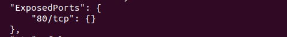

# Simple Docker

## Part 1. Готовый докер
1. Взять официальный докер образ с nginx и выкачать его при помощи `docker pull`:
    

2. Проверить наличие докер образа через `docker images`: \
    

3. Запустить докер образ через `docker run -d [image_id|repository]`: \
    

4. Проверить, что образ запустился через `docker ps`:
    

5. Посмотреть информацию о контейнере через `docker inspect [container_id|container_name]`:
    - Размер контейнера: \
    
    
    - Список замапленных портов: \
    

    - IP контейнера: \
    

6. Остановить докер образ через `docker stop [container_id|container_name]`:
    

7. Проверить, что образ остановился через `docker ps`:
    

8. Запустить докер с замапленными портами `80` и `443` на локальную машину через команду `run`:
    

9. Проверить, что в браузере по адресу `localhost:80` доступна стартовая страница `nginx`:
    

10. Перезапустить докер контейнер через `docker restart [container_id|container_name]`:
    
    

## Part 2. Операции с контейнером
1. Прочитать конфигурационный файл nginx.conf внутри докер контейнера через команду `exec`:
    

2. Создать на локальной машине файл `nginx.conf`: \
    

3. Настроить в нем по пути `/status` отдачу страницы статуса сервера `nginx`:
    

4. Скопировать созданный файл nginx.conf внутрь докер образа через команду `docker cp`:
    

5. Перезапустить nginx внутри докер образа через команду `exec`: \
    

6. Проверить, что по адресу `localhost:80/status` отдается страничка со статусом сервера `nginx`:
    

7. Экспортировать контейнер в файл `container.tar` через команду `export`:
    

8. Остановить контейнер: \
    

9. Удалить образ через `docker rmi [image_id|repository]`, не удаляя перед этим контейнеры:
    

10. Удалить остановленный контейнер: \
    

11. Импортировать контейнер обратно через команду import: \
    

12. Запустить импортированный контейнер: \
    

13. Проверить, что по адресу `localhost:80/status` отдается страничка со статусом сервера `nginx`:
    
